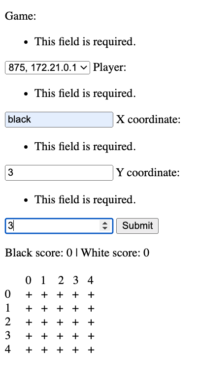
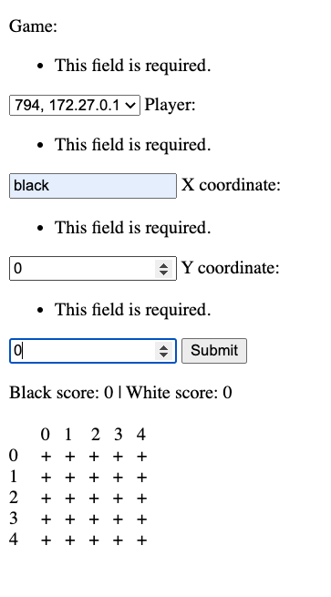

# Enabling Computer to Play Go Against a Human Player
---

- Naomi Christie
- 200724012
- Matthew Huntbach
- Computing & Information Systems

**Abstract -- This project creates a computer opponent for the game of Go using minimax and alpha-beta pruning and is implemented using the Python programming language, the Django web framework and a PostgreSQL database. The game itself is a variation of Go aimed at facilitating the learning of basic moves in the game for beginners.**
## I. Introduction
#### i. Background
The ancient Chinese two-player board game Go has attracted media attention in recent years following Google's success in writing Artificial Intelligence capable of beating the world's best human Go player (Cook, 2016). While there are many resources to play Go online both against other humans and against computers (Sensei's Library, n.d.), there are fewer resources featuring computer opponents aimed at assisting beginners to understand the basic rules. Gomoku is a game played on a Go board in which the aim is to place five stones in a row, horizontally, vertically or diagonally before one's opponent manages to get five in a row, but it loses much of the rest of the game logic, including captures (Wikipedia Contributors, 2022). The Robogo project aims to implement a new variation of Gomoku in which all the rules of the game of Go are maintained aside from the scoring method, which is simplified down to: the winner is the first to get five stones in a row vertically or horizontally (not diagonally). The human player will play against a computer allowing them to learn how moves and captures work on a Go board without needing to find a knowledgeable human opponent. While there are resources to play Gomoku against computers online (gomokuonline.com, n.d, gomoku.yjyao.com, n.d.) on investigation I could not find this unusual variation in which capture rules are upheld available and therefore it represents a new offering to the Go playing world.

At present Robogo is partially implemented: the game is currently played on a five-by-five board, with a win condition of four stones in a row either horizontally or vertically (not diagonally). Capture and Ko rules are yet to be implemented in the game. The computer is yet to lose against a human player. In the following report I will explain how I brought Robogo to its current state, and the next steps anticipated in its development.

#### ii. Terminology
This section of the report will cover some terms common in the game of Go.
- Stone: a player's piece, can be black or white
- Group: a collection of stones which are touching on the board
- Capture: when a stone or group of stones is surrounded on all sides they become the prisoners of the opponent
- Ko rule: the board must not return to an identical state during gameplay. This rule prevents the game from stalling
- Intersection: stones are played not within the lines of the grid, but on the cross-shapes which are made by the lines, these are known as intersections
- Liberty: a stone or group of stones which are yet to be captured have free spaces around them horizontally and vertically, these are known as liberties. Once a group has zero liberties it is captured
- Jump: a move in the game which doesn't connect to a stone, but is some number of places away
- Connecting move: a move in the game which links directly to another stone either horizontally or vertically

## II. Literature Review
#### i. Language and framework
The decision to write Robogo in Python was based on two things - firstly the popularity of the language; 58% of respondents to the StackOverflow 2022 developer survey said they had 'done extensive development work' in Python over the last year or 'want to work in' Python over the next year (Stack Overflow, 2022), and secondly its status as a back-end language, therefore suitable for the most significant feature of this project which was allowing a computer to play the game.

Flask and Django were both considered for the project. Flask is a lightweight web framework best suited for building APIs, whereas Django is geared towards fuller projects featuring some element of user interface alongside the back-end (Campbell, 2022; Robinson, 2017). In addition Django allows for easy integration with databases through its models, providing a 'single, definitive source of information' (djangoproject.com, n.d.) about the data in the project.

A range of online Django tutorials (Parker, 2017; djangoproject.com, n.d.; Portella, 2021) were used as models for how to build up the project, with the greatest reliance on on Django's own official starter project (djangoproject.com, n.d.).

Various front-end point-and-click graphical options were investigated. Initially the pygame library for Python was considered (Clark, 2022), but eventually was ruled out as it would have been complex to integrate this with a Django back-end in the available time. Using css, html and javascript to render the board was also considered (Lung, 2020; viethoang, 2017), but again on further investigation this implementation would have required a significant amount of effort to be devoted to integration into the Django ecosystem, and can easily become unwieldy (saaspegasus.com, 2021). Eventually the decision was made to rely only on Django's in-built templates and views, and to render the Go board using unicode characters. There are various conventions for preparing ascii Go diagrams (Wedd, n.d.), and the eventual design used these as an inspiration, but adapted from these to make the board easier to read as moves were made. Using Django forms (djangoproject.com, n.d.) was chosen over point and click, again in order to reduce the amount of time spent on front-end coding.

#### ii. Minimax and Alpha-Beta Pruning
The main resources for understanding minimax and alpha-beta pruning were Winston's 2010 lecture entitled 'Search: Games, Minimax and Alpha-Beta' (Winston, P. H, 2010), and Jain's Blog post on minimax and alpha-beta Pruning (Jain, 2017).

Additionally Lane's blog post on writing binary trees in Python was used as a model for how to build a tree by using a Python class to create the node object (Lane, 2021).

## III. Robogo User Guide

The user should make sure they have Docker (Docker, n.d.) installed on their machine. Then open a terminal at the robogo directory and type in the following command:
`./start_game.sh`

Note: if you get an error message saying `permission denied: ./start_game.sh` then please run the following command: `chmod u+x start_game.sh` and then try `./start_game.sh` again.

This should open the game in a web browser. The user should see a page showing a simple 5x5 Go board where the intersections are labelled as plus signs, and the coordinates, 0-4, are labelled along the top and the right hand side.

##### Image showing the board an input form before moves are made


##### Image showing how to input game, player and moves for the board


A form at the top of the screen will allow the user to state which game they are playing (based on their IP address), which colour player they're playing (human user should always play the black player), and which X and Y coordinates they want to play at. In this iteration the form on the first page is a bit confusing for the player as the label for the subsequent input fields appears to the right of the previous one. In future iterations this bug will be fixed. When the user gives coordinates for their move the move will appear on the board, and white's response will be displayed at the same time. It can take up to two minutes for the moves to display on the board as the algorithm calculates white's best move. In future iterations of the game there will be a visual indication that the computer is thinking, such as a loading message on screen. Once the moves show on the board the human user can then input the coordinates of their next move, and so on. The game detects when a user has four stones in a row and then declare that this player as the winner.

**Errors:**
If the user inputs coordinates which are out of range they will forfeit that move and white will play instead. In later iterations this will be replaced with warnings to the user and the opportunity to input valid coordinates.

**Notes:**
Capture logic and the Ko rule are yet to be implemented in this iteration of the software.

## IV. Robogo program

#### i. Overview
Robogo is implemented using the Django web framework for the Python language and a PostgreSQL database. Docker containerisation has been employed in order to make it easier to run the code from different computers or servers by automating the process of setting up dependencies. Online resources (Thagana, 2022; Docker, n.d.) were referred to in order to set up Docker for this project. The Django framework uses Model, View, Template structure. The Model represents both the classes in the program and the items in the database. The View handles the logic in order to prepare information for the Template, which is the means of viewing the relevant information from a web browser. Django was chosen in order to simplify the coupling of concepts in the code to the database, create some ready-made structure to the code and to ease the rendering of information as a web page. The code to allow the computer to select the best move is stored in `games/minimax.py` and `games/go_minimax_joiner.py` and implements the minimax algorithm.

#### ii. Minimax with Alpha-Beta Pruning
TODO ADD REFERENCES TO THIS PARAGRAPH
The minimax algorithm allows the computer to optimise its choice of next move by looking ahead a number of steps in the game by creating a game tree made up of potential moves for each point in the game. The algorithm then assesses the utility of the moves at the given future point in the game. For ease this future point in the game will be referred to as the terminal state, although in reality is will normally be a few moves on in the game and not the end state of the game and greater discussion on the reasons behind that will come later. From this terminal state, the algorithm works back up the tree to establish the most optimal move for each player at each point by inheriting the utility from the terminal state. For a two-player game such as Go the computer will always choose the move with the minimum utility to its opponent and presume that its opponent will select their move for maximum utility, and this alternating minimising and maximising of utility is where the term minimax derives. Alpha beta pruning is layered over minimax to reduce the amount of computing time required to calculate the optimal move. It works by navigating the game tree to the terminal state of one branch and establishing the utility of the optimal move on that branch, now when the next branch is assessed, as soon as the utility breaches the threshold value set by the first branch we can ignore all paths below that level and avoid these calculations.

In this project minimax is implemented in the file `games/minimax.py`. The core elements in this file are a base class called `MinimaxNode` and the algorithm itself, which is a free function called `minimax_with_alpha_beta_pruning_algorithm`. The code in this file is agnostic to which game is being played, and although it's used in Robogo in order to play this variation of Go, it could equally be used for any adversarial two-player pure logic game, such as Chess.

#### MinimaxNode
In earlier iterations of the code, MinimaxNode featured member variables to allow a tree to be built for future inspection such as score for that node and an array of its children, which in turn were also MinimaxNodes. It also had method called `get_optimal_move` which was used on the penultimate nodes in order to determine which terminal node would be selected. The method looped over the leaves of the penultimate node, and selects the one with the best score for the player, so if it's the minimiser this is the score which is worst for the opponent, and if it's the maximiser it's the score which is best for itself.

```
def get_optimal_move(self):
    # output is Node
    if not self.children:
        raise Exception(
            f"get_optimal_move error for {self.get_node_id()}: node has no children {[child for child in self.children]}"
        )
    best_move = self.children[0]
    player_to_move = self.player_to_move
    best_score = best_move.get_score()
    best_path_depth = best_move.get_path_depth()

    strategy = self.maximizer_strategy
    if player_to_move == "minimizer":
        strategy = self.minimizer_strategy

    for child in self.children:
        child_score = child.get_score()
        child_path_depth = child.get_path_depth()
        if player_to_move == "maximizer" and child_score == HIGHEST_SCORE:
            best_move = child
        if player_to_move == "minimizer" and child_score == LOWEST_SCORE:
            best_move = child
        elif minimizer_is_on_losing_path(player_to_move, child_score, best_score):
            if child_path_depth < best_path_depth:
                best_path_depth = child_path_depth
                best_move = child
        elif strategy(child_score, best_score):
            best_move = child
            best_score = best_move.get_score()
    return best_move
```

During the course of developing the code and reading online resources (Jain, 2017; Serrão, 2021; GeeksforGeeks, 2021) I realised that it was possible to do all the relevant calculations during the algorithm without storing the outcomes in the node objects, so the code in its current state does this to reduce the number of actions the algorithm has to perform in an attempt to speed up processing time. Almost all of the functions and members which used to reside in the MinimaxNode class are now gone.

#### minimax_with_alpha_beta_pruning_algorithm
The `minimax_with_alpha_beta_pruning_algorithm` function was developed using a number of online resources such as Jain's blog post (21). The function takes a MinimaxNode as its only required argument, and then has optional arguments for depth, winning_score and start_time. Depth and winning score both have default values set elsewhere in the code, while start_time is used if we want to apply a timeout to the function, but is not required in all cases (for example it isn't used in the tests). The function then checks if its base case has been met: if we've reached full depth or if the node has a winning utility. If either of these conditions are met then it returns a dictionary with the best score and the move node which will take the computer down the path with that best score. If the base case hasn't been met then the code then sets up some variables for use in the recurse case. `alpha` is the variable representing the best score for the maximizer and is initialised at -infinity, i.e. the worst possible score for the maximizer. `beta` is the variable representing the best score for the minimizer, and is initialised at the worst possible score for the minimizer; infinity. `best_score` is the variable for storing the best score found so far while navigating the game tree and is set to -100 if the player to move is the maximizer or 100 if it's the minimizer - I chose different values from the alpha and beta values in order to make it easier to examine what was happening in the code from the logs and the debugger. Finally `func` is a variable which is set to the Python inbuilt function max if the player to move is the maximizer, or min if the player to move is the minimizer - `func` will be used during the recursion to select the best move. We now begin examining the children of the parent node. This is done by looping over the output of the generator: `generate_next_child_and_rank_by_proximity`, which I will discuss in further detail later on in this report. At this stage the algorithm recurses, i.e. calls itself. The effect of this is that the first child of the root node will find its first child and so on until the base case is met, at which point the utility of the node is evaluated and returned alongside the node itself. Now the best score is found by taking the `func` of the best score from the result and the existing best score - i.e. the minimum of the two if it's the minimizer's turn to play or maximum if it's the maximizer. If our best score at this stage matches the score of this node, then the current child node is assigned the status of best node. At this stage if it's the maximizer's turn to move we set alpha, or beta if it's the minimizer's turn. We use `func` again to get the correct value comparing `best_score` to alpha or beta. At this stage we check if break conditions have been met. The following cases are valid break conditions: 1. alpha is greater or equal to beta - in this case we know that any remaining nodes down this branch of the tree cannot be an improvement on what we have available now, or put another way, continuing down this path would inevitably give the opponent an advantage. The other break conditions are if we're at a winning node as we don't need to examine the tree beyond a winning state, or if the process has timed out. The time out was set to 60 seconds, and this is in order to prevent highly prolongued lagging, but comes with the downside that not all options will have been evaluated and the move suggested after timeout may not be the best move in the game, simply the best of all the moves evaluated over the course of a minute. The function returns the best score and the move node from which the score came either once all child nodes on that level have been evaluated or when a break condition is met. The result is returned to the next level up in the loop, i.e. the parent node until it reaches the root node at which point we have the best move available for the root node which can then be presented in the UI.

In order for Minimax to work it's necessary to be able to determine the utility of the terminal nodes, which is where the logic of the given game becomes relevant. In order to separate out the Go logic from the pure Minimax code a new class called `GoNode` was created in `games/go_minimax_joiner.py`. `GoNode` inherits all the variables and methods from `MinimaxNode` and in addition has the ability to examine any given board state. In order to determine the utility of the board state for a terminal node `GoNode` looks for all stones grouped in horizontal or vertical lines, and keeps a running score of the highest number of stones per player and then returns the highest group length as that player's score.

TODO DESCRIBE THE VARIOUS APPROACHES TO GENERATING CHILDREN NODES
**Getting node children; various approaches:**
There are a number of approaches available for generating the children of a given node. Two options are to generate all the children up front, or to use a generator in order to yield the children one at a time. I experimented with both approaches and found that the generator improved the algorithm speed.

```
## 2
BOARD_SIZE = 9
WINNING_SCORE = 5
MAX_TREE_DEPTH = 3
child getter = get_all_children_and_rank_by_proximity

Calculated white move: (1,1)
Minimax seconds to execute: 60.1060

## 4
BOARD_SIZE = 9
WINNING_SCORE = 5
MAX_TREE_DEPTH = 3
child getter = generate_next_child_and_rank_by_proximity

Calculated white move: (1,1)
Minimax seconds to execute: 55.3870
```

The other set of options when generating node children is whether to generate the next move sequentially on the board, or to rank moves according to some known strategy. Initially I used a generator which simply iterated over all board positions yielding the next valid move. One drawback of this approach is that the gameplay doesn't appear very natural, as when all moves were equally bad the algorithm would simply make the first available move. A potential advantage to ranking moves is it can speed up the algorithm as it evaluates moves with a higher likelihood to have a good outcome first. It also leads to more natural moves, and increased the likelihood of blocking moves when the computer was on a losing path.

The code for generating node children looks at each place on the board where a stone has already been placed and generates node children connecting to those stones. Once all connecting positions have been generated it then generates moves with a jump of 1 away from each stone, and then an jump of 2 and so forth.

During early development the list of potential moves was kept artificially short in order to preserve computing resource, in particular before the alpha-beta pruning was applied. Another benefit to restricting move options is creating a beginner-friendly computer player who takes a simplistic strategy similar to that that human beginners tend to adopt. This beginner strategy involved either directly blocking one's opponent, or alternatively connecting to one's own stones directly. More sophisticated gameplay tends to involve moves which don't always connect to one's own stones or the opponent's stones.

TODO EXPLAIN THE VARIOUS MINIMAX FUNCTIONS I'VE USED ALONG THE WAY AND WHY I SETTLED ON THE ONE IN USE NOW
The initial iteration of Minimax only went one layer deep, i.e. treated the current board state as the penultimate move before assessing utility. As it only went one layer deep and also deliberately only made connecting moves it was very easy to beat the computer.

```
def build_and_prune_game_tree_recursive(
    self,
    parent,
    depth=MAX_TREE_DEPTH,
    node_ids=set(),
    winning_score=WINNING_SCORE,
):
    """
    Builds game tree to a given depth

    Parameters:
        parent (MinimaxNode): the node from which we build down
        depth (int): how far down the tree we want to build
        node_ids (set): all the move ids which have been
            encountered so far
        winning_score: how many stones in a row constitutes a win

    Returns:
        parent_utility at full depth and best_score at all other levels

    Side effects:
        builds tree from parent
    """
    # Make sure we don't use same node twice
    parent_node_id = parent.get_node_id()
    node_ids.add(parent_node_id)

    parent_utility = parent.find_utility(winning_score=winning_score)

    raise_error_if_depth_less_than_zero(depth)

    # Base case
    # If we're at a leaf node leave the recursion
    # a leaf node is a node at full depth or a winning node
    if depth == 0 or is_win_state(parent, parent_utility):
        raise_error_if_node_has_children(
            parent, depth, message="Leaf nodes shouldn't have children"
        )
        parent.set_score(parent_utility)
        parent.set_path_depth(depth)

        logger.debug(
            f"Returning at depth of {depth} with score of {parent_utility} at node: {parent_node_id}"
        )
        return {"best_score": parent_utility, "path_depth": depth}

    alpha = -INFINITY
    beta = INFINITY
    player_to_move = parent.get_player_to_move()
    best_path_depth = MAX_TREE_DEPTH

    if player_to_move == "maximizer":
        best_score = LOWEST_SCORE
        func = max
    elif player_to_move == "minimizer":
        best_score = HIGHEST_SCORE
        func = min

    # recurse case
    cells_are_not_populated = set(list(itertools.chain(*parent.get_board_state()))) == set(["+"])


    child_generator = parent.generate_next_child


    for child in child_generator(depth, parent_node_id):
        child_node_id = child.get_node_id()
        raise_error_if_node_has_children(
            child, depth, message="Nodes should initialise without children"
        )

        # Make sure we don't use same node twice
        if node_already_visited(child_node_id, node_ids):
            continue

        # **************************************************************************
        # use recursion to build tree vertically
        res = self.build_and_prune_game_tree_recursive(
            child, depth - 1, node_ids, winning_score=winning_score
        )
        path_depth = res["path_depth"]
        best_score = func(
            res["best_score"],
            best_score,
        )
        best_path_depth = min(best_path_depth, path_depth)
        # **************************************************************************

        # to get to this stage:
        # 1. we've reached the end of depth count-down
        # This means first we'll get to the point we want to stop building vertically
        # and then add children at this level. Once all children are added we will work
        # back up the tree and add child nodes at higher levels

        # build tree horizontally
        parent.add_child(child)
        parent.set_score(best_score)
        parent.set_path_depth(child.get_path_depth())

        # set alpha and beta
        if player_to_move == "maximizer":
            alpha = func(best_score, alpha)
        elif player_to_move == "minimizer":
            beta = func(best_score, beta)

        # break loop if beta <= alpha
        if break_conditions_are_met(alpha, beta):
            logger.debug(f"Breaking at {parent.__str__()}")
            break

    logger.debug(
        f"Returning at end of function {parent_node_id} alpha, beta: {(alpha, beta)}"
    )
    return {"best_score": best_score, "path_depth": depth}


def minimax_depth_of_2(self, winning_score=WINNING_SCORE):
    depth = 2
    self.build_and_prune_game_tree_recursive(self.root_node, depth, set())

    current_node = self.root_node

    for child in current_node.get_children():
        for child2 in child.get_children():
            child2.set_score(child2.find_utility(winning_score=winning_score))
        child2_optimal_move = child.get_optimal_move()
        child.set_score(child2_optimal_move.get_score())

    return self.root_node.get_optimal_move()

def find_depth_recursive(self, node, depth):
    if depth > MAX_TREE_DEPTH:
        raise Exception(f"Maximum tree depth of {MAX_TREE_DEPTH} exceeded")

    # Base case
    # If we're at a terminal node leave the recursion
    if node.is_leaf_node():
        logger.debug(f"child {type(node)}")
        logger.debug(
            f"depth: {depth}, node_id: {node.get_node_id()} is_leaf_node: {node.is_leaf_node()}"
        )
        logger.debug(f"returning at depth of {depth} owing to terminal node")
        return depth

    # recurse case
    for i, child in enumerate(node.children):
        logger.debug(
            f"depth: {depth}, child index: {i}, node_id: {child.get_node_id()} is_leaf_node: {child.is_leaf_node()}, child type: {type(child)}"
        )
        return self.find_depth_recursive(child, depth + 1)

    logger.debug(f"Returning because end of function depth {depth}")
    return

```

#### iii. Database
The database software used for this project is PostgreSQL. The database consists of two tables: Games and Moves. Each user can play one game per device as their game is tied to their IP address. Each game can have zero to many moves, and if the game is deleted all of its moves also get deleted from the database.

#### iv. Front End
The front-end is implemented using Django's templating functionality which in turn uses Jinja scripting. The board is rendered using "+" to represent empty intersections, "●" to represent black stones and "○" to represent white stones.

## V. Testing and Error Handling
#### i. Test driven development
TODO COMPLETE THE TDD SECTION OF THE REPORT (MOVE SOME THINGS OVER FROM REFLECTIVE ESSAY)
This section of the report will discuss the concept of test driven development (TDD) and how it was used during the writing of the code. Please see `games/tests` for the tests written on the code in this project, further explanation to follow.

#### ii. Error-handling
TODO COMPLETE THE ERROR HANDLING SECTION OF THE REPORT (MOVE SOME THINGS OVER FROM REFLECTIVE ESSAY)
This section of the report will discuss the importance of error handling and how it's used in the software. At present there is very little error handling - only one try/except block. As the project develops more error handling will be included.

#### Observations
TODO WRITE UP MY OBSERVATIONS
- Larger board increases complexity quite a lot, as does more stones in a row to win
- Stones to win equalling board size reduces complexity, but also makes game play less interesting

## V. Conclusion
TODO UPDATE THE CONCLUSION
In order to meet the original aims of this project the Minimax algorithm needs to go a number of layers down the game tree in order to make more sophisticated choices for the next move. Alpha-beta pruning also needs to be deployed in order to preserve computing effort in order to calculate possibilities further down the tree. The restriction on moves to just connecting moves needs to be lifted and replaced with jump moves in order to offer intermediate gameplay, and no restrictions for advanced gameplay. In order to implement minimax with alpha-beta pruning recursive methods for nodes should be used, as illustrated in Jain's blog (21). The full capture and Ko rules were not implemented in this iteration and would also need to be coded into the program in order to meet the original goals. One challenge is identifying groups of stones as this is required in order to determine capture logic. A potential solution to finding stone groups would be to add a method to the `GoNode` which would walk the board state and when it finds a stone look for all connecting stones and add that to a stone group object stored in the node.

## References:

Cook, M (2016) 'AlphaGo: beating humans is one thing but to really succeed AI must work with them' *The Guardian, 15 March 2016.* [online] Available at: https://www.theguardian.com/technology/2016/mar/15/alphago-ai-artificial-intelligence-beating-humansgoogles-alphago-seals-4-1-victory-over-grandmaster-lee-sedol [Accessed 23 August 2022]

Sensei's Library (n.d.), 'Go servers.' [online] Available at: https://senseis.xmp.net/?GoServers [Accessed 23 August 2022]

Wikipedia Contributors (2022). 'Gomoku'. [online] Available at: https://en.wikipedia.org/wiki/Gomoku. [Accessed 23 August 2022]

gomokuonline.com. (n.d.). 'Play Gomoku online'. [online] Available at: https://gomokuonline.com/ [Accessed 23 August 2022]

gomoku.yjyao.com. (n.d.). 'Gomoku'. [online] Available at: https://gomoku.yjyao.com/ [Accessed 23 August 2022]

Stack Overflow (2022). 'Developer Survey'. [online] Available at: https://survey.stackoverflow.co/2022/#most-popular-technologies-language-learn [Accessed 23 August 2022]

Campbell, S (2022) 'Flask vs Django: What’s the Difference Between Flask & Django?' [online] Available at: https://www.guru99.com/flask-vs-django.html [Accessed 23 August 2022]

Robinson, S (2017). 'Flask vs Django', *Stack Abuse*, 27 September 2017. [online] Available at: https://stackabuse.com/flask-vs-django/ [Accessed 23 August 2022]

djangoproject.com (n.d.). 'Models'. [online] Available at: https://docs.djangoproject.com/en/4.0/topics/db/models/ [Accessed 23 August 2022]


Parker, C (2017). 'Tutorial: Create a real-time web game with Django Channels and React'. [online] Available at: https://codyparker.com/django-channels-with-react/8/ [Accessed 23 August 2022]

djangoproject.com (n.d.). 'Writing your first Django app'. [online] Available at: https://docs.djangoproject.com/en/4.0/intro/tutorial01/ [Accessed 23 August 2022]

Portella, L (2021). 'Django Essential Training', *Linkedin Learning* 23 September 2021. [online] Available at: https://www.linkedin.com/learning/django-essential-training/ [Accessed 23 August 2022]

Clark, T. H (2022), 'Python Miniproject: Making the Game of Go from Scratch in PyGame', *Medium* [online] Available at: https://towardsdatascience.com/python-miniproject-making-the-game-of-go-from-scratch-in-pygame-d94f406d4944 [Accessed 23 August 2022]

Clark, T. H (2022), 'gogame', GitHub. [online] Available at: https://github.com/thomashikaru/gogame [Accessed 23 August 2022]

Lung, L-H (2020), 'How To Make A Go Board With CSS', *Medium* [online] Available at: https://levelup.gitconnected.com/how-to-make-a-go-board-with-css-ac4cba7d0b72 [Accessed 23 August 2022]

viethoang (2017), 'Go (Game) 9x9', *Codepen* [online] Available at: https://codepen.io/viethoang012/pen/ygzZaB [Accessed 23 August 2022]

saaspegasus.com (2021) 'Organizing your Front-End Codebase in a Django Project' *SaaS Pegasus*, June 2021. [online] Available at: https://www.saaspegasus.com/guides/modern-javascript-for-django-developers/client-server-architectures/ [Accessed 23 August 2022]

Wedd, N (n.d.) 'Presentation of ascii Go diagrams' [online] Available at: http://www.weddslist.com/goban/ [Accessed 23 August 2022]

djangoproject.com (n.d.). 'Working with forms'. [online] Available at: https://docs.djangoproject.com/en/4.0/topics/forms/ [Accessed 23 August 2022]

Winston, P. H (2010) 'Search: Games, Minimax, and Alpha-Beta', MIT Open Courseware, [online] Available at: https://www.youtube.com/watch?v=STjW3eH0Cik [Accessed 23 August 2022]

Jain, R (2017) 'Minimax Algorithm with Alpha-beta pruning', *hackerearth*, March 31 2017. [online] Available at: https://www.hackerearth.com/blog/developers/minimax-algorithm-alpha-beta-pruning/ [Accessed 23 August 2022]

Lane, W (2021) 'Writing a Binary Search Tree in Python with Examples', *boot.dev*, 20 July 2021. [online] Available at: https://blog.boot.dev/computer-science/binary-search-tree-in-python/ [Accessed 23 August 2022]

Thagana, K (2022). 'Dockerizing a Django app', *LogRocket*, April 8 2022. [online] Available at: https://blog.logrocket.com/dockerizing-django-app/ [Accessed 23 August 2022]

Docker (n.d.). 'Quickstart: Compose and Django' [online] Available at: https://docs.docker.com/samples/django/ [Accessed 23 August 2022]

Docker (n.d.). 'Get Docker', [online] Available at: https://docs.docker.com/get-docker/ [Accessed 23 August 2022]

Serrão, R. G (2021) 'Minimax algorithm and alpha-beta pruning', *Mathspp* [online] Available at: https://mathspp.com/blog/minimax-algorithm-and-alpha-beta-pruning [Accessed 23 August 2022]

GeeksforGeeks (2021). 'Minimax Algorithm in Game Theory | Set 4 (Alpha-Beta Pruning)' *GeeksforGeeks*, 18 August 2021, [online] Available at: https://www.geeksforgeeks.org/minimax-algorithm-in-game-theory-set-4-alpha-beta-pruning/ [Accessed 23 August 2022]

